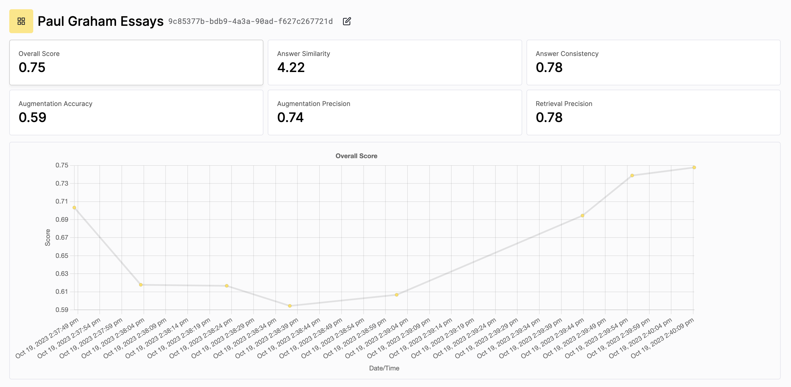

<p align="center">
  
  
</p>

Tonic Validate helps you develop your retrieval augmented generation (RAG) system by providing RAG metrics and a platform for tracking and evaluating experiments and changes to your RAG system. This is **Tonic Validate Logging**, the logging component of Tonic Validate - how you send your RAG system output to the Tonic Validate Application. When you log RAG system outputs using Tonic Validate Logging, the outputs are scored using [Tonic Validate Metrics](https://github.com/TonicAI/tvalmetrics), and then the outputs and scores are sent to the [Tonic Validate Application](https://validate.tonic.ai), where the outputs and responses are visualized allowing you to easily track the performance of you RAG system.

*  [Tonic Vaidation Documentation](https://docs.tonic.ai/validate/)

# Getting Started

1. Sign up for a [free Tonic Validate account](https://validate.tonic.ai/signup).
2. Install Tonic Validate Logging via pip
   ```
   pip install tvallogging
   ```
3. [Get a Tonic Validate API key](https://docs.tonic.ai/validate/getting-started-with-tonic-validate/tonic-validate-obtain-sdk-access-token), and set it in your environment as the `TONIC_VALIDATE_API_KEY` environment variable.
4. Set up a project and a benchmark dataset of questions and reference answers, and the log your RAG system responses to the questions in the benchmark. Use the following code snippet to get started. Tonic Validate uses LLM assisted evaluation to score your RAG responses, so in addition to assuming you have the `TONIC_VALIDATE_API_KEY` environment variable set to you Tonic Validate API Key, it also assumes you have the `OPENAI_API_KEY` environment variable set so Open AI models can be used to evaluate your RAG responses.
   ```python
   import os
   # to set the environment variables via python
   os.environ["OPENAI_API_KEY"] = "put-your-openai-api-key-here"
   os.environ["TONIC_VALIDATE_API_KEY"] = "put-your-tonic-validate-api-key-here"
   
   from tvallogging.api import TonicValidateApi
   from tvallogging.chat_objects import Benchmark
   
   project_name: str # name of your new project
   benchmark_name: str # name of your new benchmark
   # list of dictionaries of the form
   # {
   #     "question": "question for the benchmark",
   #      "answer": "reference answer to the question"
   # }
   question_with_answer_list: List[Dict[str, str]]
   
   api = TonicValidateApi()
   
   benchmark = Benchmark.from_json_list(question_with_answer_list)
   benchmark_id = api.new_benchmark(benchmark, benchmark_name)
   
   project = api.new_project(benchmark_id, project_name)
   
   llm_evaluator = "gpt-4"
   run = project.new_run(llm_evaluator)
   
   for question_with_answer in run.benchmark.question_with_answer_list:
   
       question = question_with_answer.question
   
       llm_answer: str # answer obtained from the RAG system
       retrieved_context_list: List[str] # list of context retrieved by the RAG system
   
       # log the llm_answer and retrieved_context_list to Tonic Validate
       # in this step, the RAG metrics are calculated locally
       run.log(question_with_answer, llm_answer, retrieved_context_list)
   ```
5. Review how your RAG system is performing in the Tonic Validate UI.
   <p align="center">
     
   </p>

# Documentation and Tonic Validate Metrics

* [Tonic Vaidation Documentation](https://docs.tonic.ai/validate/) has extensive information on how Tonic Validate works and the RAG metrics used in Tonic Validate.
* Check out [Tonic Validate Metrics](https://github.com/TonicAI/tvalmetrics) for more information about the RAG metrics used in Tonic Validate and if you're interested in computing the RAG metrics outside of Tonic Validate.
